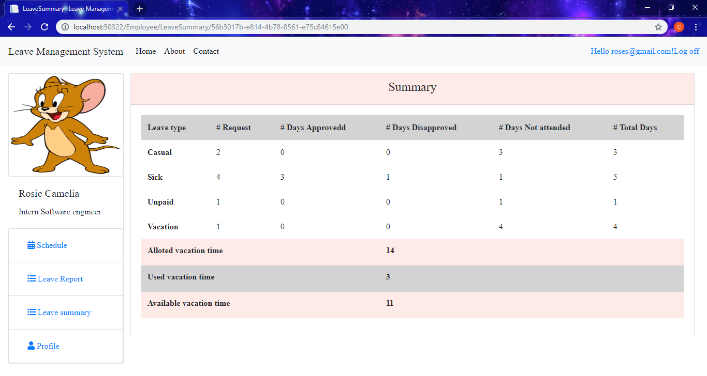

# LeaveManagementSys
Leave management system  allow the process of managing employee time-off request efficiently.Employees can request and submit their leaves online  and the administrator will view all the request to approve or reject their leaves. 

 
 

An employee can :
<ul>
  <li> Submit leave requests online </li>
  <li> View leave summary </li>
  <li>  Manage pending, accepted and rejected leave requests</li>
</ul>

An administrator can:
<ul>
  <li> Approve or reject request from employees</li>
 </ul>
